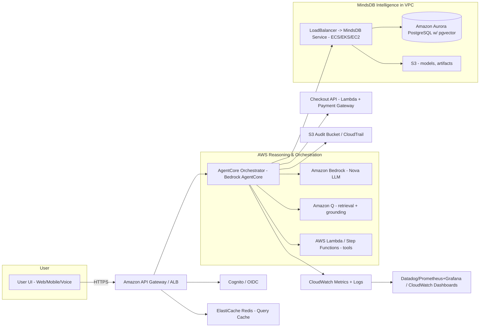
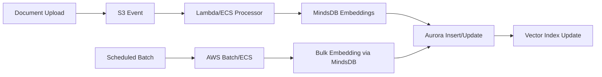

# Design Document

## Overview

The MindsDB RAG Assistant is an AWS-hosted intelligent e-commerce assistant that combines:

- **AWS Bedrock** (AgentCore + Nova LLM) — orchestration, planning, and conversational generation
- **MindsDB** — semantic retriever + structured ML predictors (predictors exposed via SQL and REST)
- **AWS infrastructure** — for storage, compute, security, monitoring, and deployment

**Primary non-functional constraints:**
- **Latency target:** end-to-end retrieval + prediction < 300ms (typical path)
- **Explainability:** predictions include feature_importance and human-readable explanation
- **Tenant isolation:** strict merchant_id filters & tenant-specific predictors
- **Cost target:** ≤ $0.05 per session average (monitored & alerted)

## Architecture

### High-Level System Flow



**Notes:**
- MindsDB is hosted inside a private VPC (ECS/EKS/EC2) with an internal ALB
- RDS is Amazon Aurora PostgreSQL with pgvector extension
- Embedding generation uses MindsDB embedding models via Lambda or ECS jobs

### Component Architecture

The system follows a microservices architecture with explicit AWS service mappings:

1. **API & Auth Layer** - API Gateway, Cognito, WAF
2. **AgentCore Orchestrator** - AWS Bedrock AgentCore with DynamoDB session store
3. **MindsDB RAG Engine** - ECS/EKS hosted MindsDB with Aurora PostgreSQL
4. **Caching Layer** - ElastiCache Redis for sub-10ms cache hits
5. **Document Pipeline** - S3, Lambda/ECS for embedding processing
6. **Security & Secrets** - KMS, Secrets Manager, VPC with private subnets
7. **Monitoring Stack** - CloudWatch, CloudTrail, Prometheus/Grafana

## Components and Interfaces

### API & Authentication Layer

**Amazon API Gateway (or ALB):** Public ingress for client requests
**Amazon Cognito (or OIDC):** Authentication with JWTs carrying merchant_id claims
**AWS WAF:** Basic request filtering and IP protections

### AgentCore Orchestrator (AWS Bedrock)

**Purpose:** Amazon Bedrock AgentCore acts as the central orchestrator

**Key Functions:**
- Receives parsed intent from the LLM/clients
- Constructs plans that invoke Amazon Q, MindsDB predictors, Checkout API, and other tool Lambdas
- Maintains conversation state persisted in DynamoDB with merchant_id & session TTL

**Key Interfaces:**
- `POST /chat` - Main chat endpoint accepting user queries
- `GET /session/{id}` - Retrieve conversation state from DynamoDB
- `POST /session/{id}/reset` - Clear conversation history

**Internal Functions:**
```typescript
interface AgentCore {
  parseIntent(query: string, context: SessionContext): Promise<IntentPlan>
  orchestrateTools(plan: IntentPlan): Promise<ToolResults>
  generateResponse(query: string, context: ToolResults): Promise<Response>
  handleFailure(error: Error, fallbackOptions: FallbackOption[]): Promise<Response>
}
```

### MindsDB RAG Engine (in VPC)

**Deployment:** MindsDB running in ECS Fargate or EKS in private subnets with internal ALB
**Instance Storage:** EBS for persistent nodes (if EC2) or EFS for shared filesystem across pods
**Connectivity:** MindsDB connects to Aurora PostgreSQL (pgvector) in the same VPC

**Predictors:**
1. **semantic_retriever** - Returns top-k similar documents with scores
2. **product_signals** - Generates demand_score, purchase_probability, explanations, and feature_importance

**Per-tenant Isolation:** Each query must include merchant_id and MindsDB predictor SQL/REST validates merchant_id via IAM role or service token

**Key Interfaces:**
```sql
-- Semantic Retrieval
SELECT id, snippet, score, metadata 
FROM mindsdb.semantic_retriever 
WHERE text = :user_query 
  AND merchant_id = :merchant_id 
ORDER BY score DESC 
LIMIT 5;

-- Product Predictions with Feature Importance
SELECT sku, demand_score, purchase_probability, explanation, 
       feature_importance, confidence 
FROM mindsdb.product_signals 
WHERE sku = 'PROD_123' 
  AND user_context = '{"user_id": "u123", "session": "s456"}'
  AND merchant_id = 'merchant_ABC';
```

**Response Format:**
```typescript
interface RetrievalResult {
  id: string
  snippet: string
  score: number
  metadata: {
    sku?: string
    merchant_id: string
    document_type: string
    source_uri?: string
  }
  grounding_pass: boolean
}

interface PredictionResult {
  sku: string
  demand_score: number
  purchase_probability: number
  explanation: string
  feature_importance: Record<string, number> // explicit per-feature weight
  provenance: {
    model_id: string
    model_version: string
    training_date: string
  }
  confidence: number
  merchant_id: string
  timestamp: string
}
```

### Document Storage & Vector Database

**Amazon Aurora PostgreSQL** (recommended) with pgvector extension:
- **Index tuning:** lists tuned per dataset (e.g., lists=100 with proper VACUUM/Maintain)
- **Alternative for ultra-scale:** Amazon OpenSearch (vector support) or Amazon MemoryDB for Redis Vector

**Schema:**
```sql
CREATE TABLE documents (
  id UUID PRIMARY KEY,
  merchant_id TEXT NOT NULL,
  sku TEXT NULL,
  title TEXT NOT NULL,
  body TEXT NOT NULL,
  metadata JSONB,
  embedding vector(1536),
  document_type TEXT,
  created_at TIMESTAMP DEFAULT now(),
  updated_at TIMESTAMP DEFAULT now()
);

CREATE INDEX idx_documents_merchant ON documents(merchant_id);
CREATE INDEX idx_documents_embedding ON documents 
  USING ivfflat (embedding vector_cosine_ops) WITH (lists = 100);
CREATE INDEX idx_documents_sku ON documents(sku) WHERE sku IS NOT NULL;
```

**Scaling Options:**
- Aurora Serverless v2 or provisioned cluster with read replicas
- Scale IOPS and compute nodes based on QPS
- Use read replicas for heavy read loads

### Embedding Pipeline

**Triggers:** S3 put events or scheduled AWS Batch jobs
**Worker:** Lambda for small loads or ECS/EKS jobs for batch/high throughput
**Embedding Provider:** MindsDB embedding models via SQL/REST API
**Write Path:** Insert/update rows in Aurora with new embedding and updated_at using transaction batching

**Pipeline Flows:**

**Document Ingestion:**
Upload to S3 → S3 Put Event → Lambda/Step Functions → sanitize (PII redaction) → store raw doc in S3 + insert doc metadata to Aurora + schedule embedding job

**Embedding Processing:**
- **Real-time small updates:** Lambda calls MindsDB embedding models and writes to Aurora
- **Bulk reprocessing:** AWS Batch/ECS jobs run nightly to re-embed large batches and update vector index

**Model Retraining:**
- **Automated retrain schedule:** weekly retrain for each tenant (configurable)
- **Training:** Use historical signals from RDS + S3 event logs; runs in ECS/EKS or EC2 spot instances
- **Artifacts:** Model artifacts stored in S3 and registered in MindsDB Studio
- **Drift detection:** trigger retrain if mean prediction confidence drops below threshold



### Caching & Fast Path (to meet <300ms)

**ElastiCache (Redis)** between API Gateway and AgentCore:
- Cache top-k retrieval results by hashed query + merchant_id for hot queries
- Cache MindsDB predictor results for identical session context (with TTL)
- Use Redis near the AgentCore for sub-10ms cache hits

**Latency Budget Breakdown:**
- API Gateway + Auth: 20ms
- Cache hit retrieval (Redis): 5–10ms
- AgentCore orchestration + local state: 20–40ms
- MindsDB predictor (cold): 50–200ms (aim <150ms)
- Bedrock generation (final LLM small snippet): 50–100ms
- Network & serialization overhead: 10–20ms
- **Target path:** Cached retrieval + MindsDB cached predictor + small LLM = <300ms

**Caching Strategy:**
- Redis key: `merchant:{merchant_id}:query_hash:{sha256(query+context)}`
- TTLs: short for session-specific caches (30–120s), longer for static queries (1–24h)
- Use stale-while-revalidate: serve cached result and refresh asynchronously

### Checkout & Payments

**Checkout API:** Implemented as Lambda behind API Gateway
**Payment Integration:** Merchant payment gateway integrations (Stripe/Adyen) via secure vaults
**Transaction Logging:** RDS/DynamoDB and event publishing to SNS/SQS for order processing
**Security:** Payment tokens never stored in conversational logs; redacted at ingestion

### Security, Secrets & Network Topology

**Encryption & Data Protection:**
- KMS-managed keys for all encryption at-rest (Aurora, S3, EBS)
- TLS 1.2+ (recommend TLS 1.3) for all in-transit communications
- Sensitive conversational PII redacted or tokenized before any call to external LLMs

**Secrets & Credentials:**
AWS Secrets Manager stores:
- MindsDB service account credentials
- Aurora DB credentials
- Payment gateway keys
- Bedrock API tokens (if required)
- Secrets rotate every 90 days and are accessible via IAM roles

**Network Topology:**
- VPC with private subnets for MindsDB, Aurora, and EKS/ECS tasks
- NAT Gateway for outbound internet egress if needed
- Security groups enforce least-privilege access
- VPC endpoints: S3 interface endpoints, PrivateLink for access to Bedrock

**Tenant Isolation:**
- Query-level `WHERE merchant_id = :merchant_id` guard rails enforced in MindsDB SQL and service layer
- Optionally, run per-merchant RDS schemas or separate DB clusters for highest isolation needs

**PII Protection:**
```typescript
interface PIIRedactor {
  redactQuery(query: string): RedactedQuery
  tokenizeUserData(userData: UserContext): TokenizedContext
  sanitizeResponse(response: string): string
}

interface RedactedQuery {
  sanitizedText: string
  tokens: Map<string, string>
}
```

## Data Models

### Core Entities

```typescript
interface Document {
  id: string
  merchantId: string
  sku?: string
  title: string
  body: string
  metadata: Record<string, any>
  embedding: number[]
  documentType: 'product' | 'faq' | 'policy' | 'review'
  createdAt: Date
  updatedAt: Date
}

interface UserSession {
  sessionId: string
  userId: string
  merchantId: string
  conversationHistory: Message[]
  context: UserContext
  createdAt: Date
  lastActivity: Date
}

interface UserContext {
  preferences: Record<string, any>
  purchaseHistory: string[]
  currentCart: CartItem[]
  demographics: Record<string, any>
}

interface RAGResponse {
  answer: string
  sources: DocumentReference[]
  predictions: PredictionResult[]
  confidence: number
  reasoning: string[]
}
```

### Audit Log Entry

Stored in CloudWatch Logs + S3 archive:
```typescript
interface AuditLog {
  timestamp: Date
  merchant_id: string
  user_id?: string
  session_id?: string
  operation: string // e.g., 'predict', 'retrieve', 'checkout'
  request_payload_hash: string
  response_reference: string // S3 path for full response object
  outcome: 'success'|'failure'
  reason?: string
  actor: string // service or user
}
```
**Retention:** 12 months (configurable), encrypted via KMS

### Prompt Template Structure

```typescript
interface PromptTemplate {
  system: string
  userQuery: string
  context: {
    documents: RetrievalResult[]
    predictions: PredictionResult[]
    sessionState: UserSession
  }
  instructions: string[]
  constraints: string[]
}
```

## Monitoring, Observability & Alerting

### Required Metrics

**Retrieval Metrics:**
- `retrieval.latency_ms` (p95, p99)
- `retrieval.recall_at_k` (recall@5, recall@10)
- `retrieval.success_rate`

**Prediction Metrics:**
- `predict.latency_ms` (p95, p99)
- `predict.confidence_distribution` (histogram)
- `predict.drift_score` (compare predicted vs. observed over time)
- `predict.feature_importance_stability`

**Grounding & Quality:**
- `grounding.accuracy` (% of factual claims traceable to source docs)
- `hallucination_rate` (from automated checks/human eval)

**LLM & Orchestration:**
- `bedrock.tokens_per_session` and `bedrock.latency_ms`
- `agent.steps_per_session`

**Infrastructure:**
- CPU/RAM/connection_count for MindsDB, Aurora, EKS/ECS tasks

**Business:**
- `conversion_rate`, `avg_order_value`, `cost_per_session`

**Security & Audit:**
- `unauthorized_access_attempts`, `suspicious_activity_alerts`

### Dashboards & Alerts

**CloudWatch dashboards** for infra + predictive metrics; forward custom metrics to Prometheus if needed

**Alerts:**
- Grounding accuracy < 85% → severity-high alert
- Predict confidence drift outside threshold → retrain trigger
- Cost/session > $0.05 for 24h rolling → FinOps alert
- Retrieval latency p95 > 250ms → performance alert

**Logging:**
- Structured logs (JSON) with merchant_id, session_id, request_id
- Audit logs stored in CloudWatch Logs and archived to S3 (KMS encrypted)
- Sensitive fields redacted before logs are persisted

## Scaling & Deployment Topology

### MindsDB Layer
- Deploy MindsDB as ECS Fargate tasks (recommended) or EKS pods with HPA based on CPU/request rate
- Auto-scaling: Scale out on request rate per target group and CPU usage
- Minimum baseline capacity to avoid cold start latencies

### Aurora PostgreSQL
- Aurora Serverless v2 or provisioned cluster with read replicas to handle vector lookups
- Scale IOPS and compute nodes based on QPS; use read replicas for heavy read loads

### Bedrock & AgentCore
- Bedrock is managed by AWS — coordinate token usage and concurrency throttling via AgentCore
- AgentCore microservice (if run by you) deployed on ECS/EKS with autoscaling

### Embedding & Training Compute
- Use AWS Batch/Spot EC2 for expensive retrain jobs; run weekly or triggered by drift detection

## Cost Management & FinOps Controls

### Runtime Tracking
- Emit `cost_estimate_per_request` metric: sum of estimated Bedrock tokens * token_cost + MindsDB compute estimate + DB read cost
- Aggregate to `cost_per_session`

### Alerts & Budget
- Alarm when daily average `cost_per_session` > $0.05 for rolling 7-day window
- Budget notifications via AWS Budgets and Slack/email hooks

### Optimization Levers
- Cache heavy queries in Redis
- Use smaller LLM footprints for short replies; escalate to larger models only when needed
- Use spot instances for retrain jobs

## Error Handling & Fallbacks

### Retrieval Failures
- Fall back to Redis cached results → then to broader semantic search → finally a graceful apology and ask clarifying question

### Prediction Failures
- If MindsDB predictor times out or returns low-confidence:
  - Use default heuristic ranking (popularity + rating + freshness) and mark explanation as heuristic
  - Return explanation: "Prediction unavailable; showing best-effort recommendations."

### LLM Failures
- Retry with simplified prompt (smaller context)
- If repeated failures, use template-based canned responses

### Checkout Failures
- Implement transactional compensation:
  - If payment confirmation fails after order reserved, rollback inventory reservation and notify user
  - Keep cart state for retry and provide explicit error message describing what to do next

### Circuit Breaker & Bulkheading
- Circuit breaker per external dependency (MindsDB, Bedrock, Payment Gateway)
- Bulkheads by merchant or tenant to avoid noisy neighbor effects

```typescript
interface CircuitBreaker {
  callWithBreaker<T>(
    operation: () => Promise<T>,
    fallback: () => Promise<T>,
    config: CircuitBreakerConfig
  ): Promise<T>
}

interface CircuitBreakerConfig {
  failureThreshold: number
  resetTimeout: number
  monitoringWindow: number
}
```

## Testing & Validation Plan

### Unit & Integration Testing
- **Unit tests** for predictor output format (including feature_importance)
- **Integration:** full RAG flow (API Gateway → AgentCore → MindsDB → Bedrock) using test tenants

### Performance & Load Testing
**Load test profile:**
- Baseline: 10k users, 1k concurrent per merchant
- Verify p95 latency < 300ms on target path with cache warming
- Stress tests for failover: bring MindsDB node down and verify fallback behavior

### Accuracy & Grounding
- **Grounding accuracy tests:** automated checks comparing generated factual claims to retrieved docs (target ≥ 85%)
- **Human eval:** periodic annotation of recommendations for relevance scoring

### Security & Compliance Testing
- **Penetration testing** for VPC, Secrets Manager, and IAM roles
- **Verify PII redaction** via black-box fuzz testing

### Regression & E2E
- **Synthetic monitoring** queries every 5 minutes to measure latency, grounding, prediction confidence, and order completion rates

### Test Data Management
```typescript
interface TestDataFactory {
  createMerchantData(merchantId: string): Promise<TestMerchant>
  generateDocuments(count: number, type: DocumentType): Document[]
  mockUserSessions(concurrent: number): UserSession[]
  createPredictionBaseline(sku: string): PredictionResult
}
```

## Appendix: API & SQL Examples

### MindsDB SQL (semantic retriever)
```sql
SELECT id, snippet, score, metadata 
FROM mindsdb.semantic_retriever 
WHERE text = :user_query 
  AND merchant_id = :merchant_id 
ORDER BY score DESC 
LIMIT 5;
```

### MindsDB SQL (product predictions with feature importance)
```sql
SELECT sku, demand_score, purchase_probability, explanation, 
       feature_importance, confidence 
FROM mindsdb.product_signals 
WHERE sku = 'PROD_123' 
  AND user_context = '{"user_id": "u123", "session": "s456"}'
  AND merchant_id = 'merchant_ABC';
```

### AgentCore Tool Registration JSON
```json
{
  "id": "mindsdb_recommend",
  "endpoint": "https://internal-alb.mindsdb.svc/predict/product_recommendation",
  "auth": "IAM-role-based",
  "description": "MindsDB product recommendation predictor",
  "timeout_ms": 300
}
```