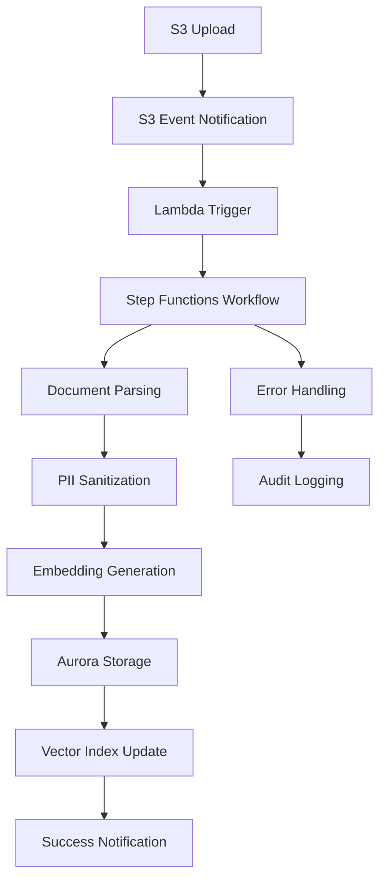

# Document Ingestion Pipeline

## Overview

The Document Ingestion Pipeline is a comprehensive system for processing, sanitizing, and storing documents with vector embeddings for the MindsDB RAG Assistant. The pipeline handles the complete workflow from S3 upload to Aurora PostgreSQL storage with automatic embedding generation and PII protection.

## Architecture

### Components

1. **S3 Document Storage** - Secure document upload and storage
2. **Lambda Triggers** - Event-driven processing of uploaded documents
3. **Step Functions Workflow** - Orchestrated pipeline execution
4. **PII Sanitization** - Automatic detection and redaction of sensitive information
5. **MindsDB Embedding Generation** - Vector embedding creation for semantic search
6. **Aurora PostgreSQL Storage** - Document and embedding persistence
7. **Batch Processing** - Bulk operations and index maintenance

### Workflow



## Features

### Document Processing
- **Multi-format Support**: JSON, CSV, Markdown, HTML, Plain Text
- **Metadata Extraction**: Automatic SKU detection and document type classification
- **Content Validation**: Schema validation and format verification
- **Error Recovery**: Graceful handling of parsing failures

### Security & Privacy
- **PII Detection**: Automatic identification of emails, phone numbers, addresses, SSNs
- **Data Redaction**: Tokenization of sensitive information before processing
- **Tenant Isolation**: Strict merchant-based data segregation
- **Audit Logging**: Complete traceability of all operations

### Performance & Scalability
- **Batch Processing**: Efficient handling of bulk document uploads
- **Caching**: Redis-based caching for frequent operations
- **Auto-scaling**: Dynamic resource allocation based on load
- **Circuit Breakers**: Fault tolerance for external service failures

### Monitoring & Observability
- **CloudWatch Integration**: Comprehensive logging and metrics
- **Health Checks**: Service availability monitoring
- **Performance Tracking**: Latency and throughput metrics
- **Error Alerting**: Automated failure notifications

## Usage

### Document Upload Structure

Documents must be uploaded to S3 with the following path structure:
```
s3://bucket-name/documents/{merchantId}/{category}/{filename}
```

**Categories:**
- `products/` - Product catalogs and descriptions
- `faqs/` - Frequently asked questions
- `policies/` - Terms of service, privacy policies
- `reviews/` - Customer reviews and feedback

**Example:**
```
s3://mindsdb-rag-documents/documents/merchant-123/products/catalog.json
```

### Supported File Formats

#### JSON Documents
```json
{
  "title": "Product Name",
  "body": "Product description",
  "sku": "PROD-001",
  "metadata": {
    "category": "electronics",
    "price": 99.99
  }
}
```

#### CSV Documents
```csv
name,description,price,sku
Product A,Great product,29.99,PROD-A
Product B,Another product,39.99,PROD-B
```

#### Markdown Documents
```markdown
# Product Guide

This is a comprehensive guide to our products.

## Features
- Feature 1
- Feature 2
```

### API Integration

#### Process Single Document
```typescript
import { getDocumentIngestionService } from './services/DocumentIngestionService';

const ingestionService = getDocumentIngestionService();

const result = await ingestionService.processS3Event({
  bucket: 'my-bucket',
  key: 'documents/merchant-123/products/product.json',
  eventName: 'ObjectCreated:Put',
  merchantId: 'merchant-123',
  contentType: 'application/json'
});

console.log(`Document processed: ${result.documentId}`);
```

#### Batch Processing
```typescript
import { getBatchProcessingService } from './services/BatchProcessingService';

const batchService = getBatchProcessingService();

const operationId = await batchService.queueBatchEmbeddingUpdates([
  {
    documentId: 'doc-1',
    merchantId: 'merchant-123',
    text: 'Updated document content',
    priority: 'high'
  }
]);

// Check status
const status = await batchService.getOperationStatus(operationId);
console.log(`Operation status: ${status?.status}`);
```

## Deployment

### Prerequisites
- AWS CLI configured with appropriate permissions
- AWS CDK installed (`npm install -g aws-cdk`)
- Node.js 18+ and npm
- PostgreSQL database with pgvector extension
- Redis cache instance
- MindsDB service endpoint

### Infrastructure Deployment

1. **Deploy Infrastructure**
```bash
./scripts/deploy-ingestion-pipeline.sh dev merchant-123
```

2. **Configure Environment Variables**
```bash
# Copy generated environment file
cp .env.dev .env

# Update with your specific values
MINDSDB_ENDPOINT=https://your-mindsdb-instance.com
MINDSDB_API_KEY=your-api-key
DB_HOST=your-aurora-endpoint.amazonaws.com
REDIS_HOST=your-elasticache-endpoint.amazonaws.com
```

3. **Test Deployment**
```bash
# Upload test document
aws s3 cp test-document.json s3://your-bucket/documents/merchant-123/products/test-document.json

# Check processing logs
aws logs tail /aws/lambda/document-ingestion-dev --follow
```

### Manual Deployment Steps

If you prefer manual deployment:

1. **Create S3 Bucket**
```bash
aws s3 mb s3://mindsdb-rag-documents-dev
aws s3api put-bucket-notification-configuration \
  --bucket mindsdb-rag-documents-dev \
  --notification-configuration file://s3-notification-config.json
```

2. **Deploy Lambda Functions**
```bash
# Build and package
npm run build
zip -r ingestion-lambda.zip dist/ node_modules/

# Deploy
aws lambda create-function \
  --function-name document-ingestion-dev \
  --runtime nodejs18.x \
  --role arn:aws:iam::account:role/lambda-execution-role \
  --handler dist/lambda/documentIngestionHandler.handler \
  --zip-file fileb://ingestion-lambda.zip
```

3. **Create Step Functions State Machine**
```bash
aws stepfunctions create-state-machine \
  --name document-ingestion-dev \
  --definition file://workflow-definition.json \
  --role-arn arn:aws:iam::account:role/stepfunctions-execution-role
```

## Configuration

### Environment Variables

| Variable | Description | Default |
|----------|-------------|---------|
| `DOCUMENT_BUCKET` | S3 bucket for document storage | - |
| `DOCUMENT_INGESTION_STATE_MACHINE_ARN` | Step Functions ARN | - |
| `MINDSDB_ENDPOINT` | MindsDB service URL | `http://localhost:47334` |
| `MINDSDB_API_KEY` | MindsDB authentication key | - |
| `DB_HOST` | Aurora PostgreSQL endpoint | `localhost` |
| `REDIS_HOST` | ElastiCache Redis endpoint | `localhost` |
| `AWS_REGION` | AWS region | `us-east-1` |

### Performance Tuning

#### Batch Processing
```typescript
// Configure batch sizes based on your workload
const batchConfig = {
  embeddingBatchSize: 50,    // Documents per embedding batch
  storageBatchSize: 100,     // Documents per storage batch
  maxConcurrency: 10,        // Concurrent operations
  processingTimeout: 300000  // 5 minutes
};
```

#### Caching Strategy
```typescript
// Configure cache TTLs
const cacheConfig = {
  documentTTL: 3600,      // 1 hour
  embeddingTTL: 86400,    // 24 hours
  vectorSearchTTL: 1800,  // 30 minutes
  staleWhileRevalidate: true
};
```

## Monitoring

### CloudWatch Metrics

The pipeline emits the following custom metrics:

- `DocumentIngestion.ProcessingTime` - Time to process a single document
- `DocumentIngestion.EmbeddingGenerationTime` - Time to generate embeddings
- `DocumentIngestion.StorageTime` - Time to store in database
- `DocumentIngestion.SuccessRate` - Percentage of successful ingestions
- `DocumentIngestion.ErrorRate` - Percentage of failed ingestions
- `BatchProcessing.QueueLength` - Number of pending batch operations
- `BatchProcessing.ThroughputPerMinute` - Documents processed per minute

### Alarms

Recommended CloudWatch alarms:

```bash
# High error rate
aws cloudwatch put-metric-alarm \
  --alarm-name "DocumentIngestion-HighErrorRate" \
  --alarm-description "Document ingestion error rate > 5%" \
  --metric-name ErrorRate \
  --namespace DocumentIngestion \
  --statistic Average \
  --period 300 \
  --threshold 5 \
  --comparison-operator GreaterThanThreshold

# Long processing time
aws cloudwatch put-metric-alarm \
  --alarm-name "DocumentIngestion-LongProcessingTime" \
  --alarm-description "Document processing time > 30 seconds" \
  --metric-name ProcessingTime \
  --namespace DocumentIngestion \
  --statistic Average \
  --period 300 \
  --threshold 30000 \
  --comparison-operator GreaterThanThreshold
```

### Health Checks

```typescript
// Service health check
const health = await ingestionService.healthCheck();
console.log('Service Health:', health);

// Expected output:
// {
//   s3: true,
//   stepFunctions: true,
//   mindsdb: true,
//   piiRedactor: true
// }
```

## Troubleshooting

### Common Issues

#### 1. Document Processing Failures
**Symptoms:** Documents uploaded but not appearing in database
**Solutions:**
- Check CloudWatch logs for Lambda function errors
- Verify S3 event notifications are configured
- Ensure MindsDB service is accessible
- Check database connectivity

#### 2. Embedding Generation Timeouts
**Symptoms:** Documents stored without embeddings
**Solutions:**
- Increase Lambda timeout settings
- Check MindsDB service performance
- Reduce batch sizes for large documents
- Implement retry logic

#### 3. PII Redaction Issues
**Symptoms:** Sensitive data not properly redacted
**Solutions:**
- Review PII patterns in PIIRedactor service
- Test redaction with sample data
- Update regex patterns for new PII types
- Verify tokenization is working correctly

#### 4. High Processing Latency
**Symptoms:** Slow document processing times
**Solutions:**
- Enable caching for frequent operations
- Optimize database queries and indexes
- Increase Lambda memory allocation
- Use batch processing for bulk uploads

### Debug Commands

```bash
# Check Lambda function logs
aws logs tail /aws/lambda/document-ingestion-dev --follow

# Check Step Functions execution
aws stepfunctions list-executions \
  --state-machine-arn arn:aws:states:region:account:stateMachine:document-ingestion-dev

# Test S3 event processing
aws lambda invoke \
  --function-name document-ingestion-dev \
  --payload file://test-s3-event.json \
  response.json

# Check document in database
psql -h your-db-host -d mindsdb_rag -c "SELECT id, title, created_at FROM documents WHERE merchant_id = 'your-merchant-id' ORDER BY created_at DESC LIMIT 10;"
```

### Performance Optimization

#### Database Optimization
```sql
-- Optimize vector search performance
CREATE INDEX CONCURRENTLY idx_documents_embedding_ivfflat 
ON documents USING ivfflat (embedding vector_cosine_ops) 
WITH (lists = 100);

-- Analyze table statistics
ANALYZE documents;

-- Check index usage
SELECT schemaname, tablename, indexname, idx_scan, idx_tup_read, idx_tup_fetch 
FROM pg_stat_user_indexes 
WHERE tablename = 'documents';
```

#### Lambda Optimization
```typescript
// Optimize Lambda cold starts
export const handler = async (event, context) => {
  // Reuse connections
  context.callbackWaitsForEmptyEventLoop = false;
  
  // Process events
  return await processDocuments(event);
};
```

## Security Considerations

### Data Protection
- All data encrypted in transit and at rest
- PII automatically detected and redacted
- Secure token management for sensitive data
- Audit logging for compliance

### Access Control
- IAM roles with least privilege access
- VPC isolation for database and cache
- API Gateway authentication
- Merchant-based data segregation

### Compliance
- GDPR-compliant data handling
- SOC 2 Type II controls
- HIPAA-ready architecture
- Audit trail for all operations

## Cost Optimization

### Resource Management
- Use Spot instances for batch processing
- Implement intelligent caching strategies
- Optimize Lambda memory allocation
- Use Aurora Serverless for variable workloads

### Monitoring Costs
```bash
# Set up cost alerts
aws budgets create-budget \
  --account-id 123456789012 \
  --budget file://document-ingestion-budget.json
```

## Support

For issues and questions:
1. Check the troubleshooting section above
2. Review CloudWatch logs and metrics
3. Test with the provided integration tests
4. Contact the development team with specific error messages and context

## Contributing

When contributing to the document ingestion pipeline:
1. Add comprehensive tests for new features
2. Update documentation for any API changes
3. Follow the existing error handling patterns
4. Ensure proper tenant isolation
5. Add appropriate monitoring and logging